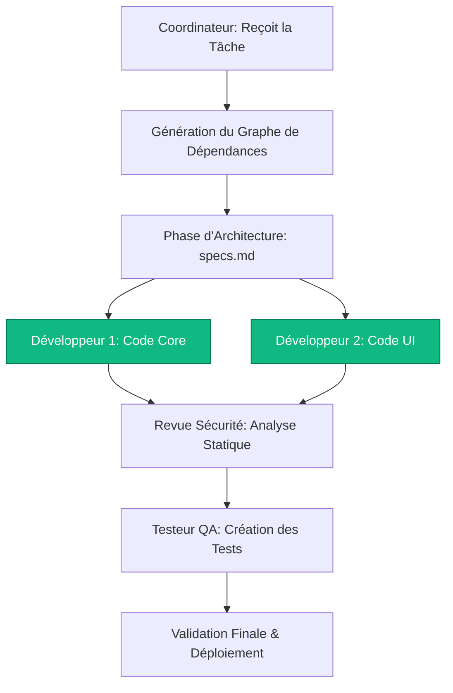

# Étude d'Architecture : Coordination d'Agents en Parallèle & Framework de Skills

Cette étude compare le modèle de coordination multi-agents actuel de **GPTMOSS** avec les paradigmes établis de **Hermes** et **OpenClaw**. Elle identifie les défis liés à la concurrence et propose une feuille de route technique pour intégrer des concepts avancés (skills packagés, verrous d'espace de travail, et exécution de graphes acycliques dirigés).

---

## 1. Modèle Actuel : GPTMOSS vs Hermes & OpenClaw

Le tableau ci-dessous compare la structure d'exécution de GPTMOSS avec les autres modèles de l'état de l'art :

| Dimension | Modèle Actuel (GPTMOSS) | Modèle Hermes (Sequential/Gated) | Modèle OpenClaw (DAG-based / Parallel) |
| :--- | :--- | :--- | :--- |
| **Orchestration** | DAG de spécialistes exécuté en parallèle selon les dépendances, avec un coordinateur final. | Portes de validation strictes entre phases (ex: Spec -> Code). | Graphe de Dépendances (DAG) exécuté en parallèle asynchrone. |
| **Gestion Concurrence** | Verrouillage de fichier au niveau stockage (`state_store.json`). | Verrouillage exclusif par fichier/branche de code. | Routage d'espaces de travail isolés (sandboxes éphémères). |
| **Capacités (Capabilities)** | Actions bas niveau granulaires (`filesystem`, `shell`). | Actions sémantiques haut niveau (Skills). | Outils composites packagés par rôle métier. |
| **Flux de Dialogue** | Flux chronologique unifié (Inter-Agents). | Logs d'événements discrets par agent. | Dialogue centralisé via un bus d'événements sémantiques. |

---

## 2. Analyse de la Concurrence et Sécurité de l'Espace de Travail

Lorsque des agents (ex: Développeur et Testeur QA) s'exécutent en parallèle, le principal risque est l'**interférence** (conditions de concurrence / race conditions) :
* **Accès concurrents aux fichiers** : Deux agents modifiant le même fichier en même temps corrompent le code.
* **Accès concurrent au terminal** : Lancer des commandes de test pendant qu'un compilateur s'exécute perturbe les résultats.

### Recommandations & Solutions Inspirées de OpenClaw
1. **Workspace Virtualization (Isolation par Agent)** : 
   Chaque sous-agent s'exécute dans une branche Git ou un répertoire temporaire isolé. Ses modifications sont fusionnées (Pull Request interne) via un agent **Revue Sécurité/Code** après validation.
2. **File-Level Locking (Verrous d'Espace de travail)** :
   Mise en place d'un gestionnaire de verrous dans `FilesystemCapability` pour empêcher l'écriture concurrente sur les mêmes ressources.

---

## 3. Vers un Framework de "Skills" (Composites réutilisables)

Plutôt que de laisser les agents manipuler directement des commandes bas niveau (`echo`, `cat`, `pytest`), nous préconisons la création d'une bibliothèque de **Skills** (similaire à OpenClaw) :

```
[Agent Coder] 
     │
     ▼ (Appelle un Skill haut niveau)
┌────────────────────────────────────────────────────────┐
│ Skill: CodeRefactor                                    │
│ ├─ 1. Lit le fichier cible                             │
│ ├─ 2. Applique le correctif                            │
│ └─ 3. Valide la syntaxe (Linter/AST parser)            │
└────────────────────────────────────────────────────────┘
     │
     ▼ (Actions bas niveau masquées et sécurisées)
[Filesystem & Shell]
```

### Avantages :
* **Moins d'itérations ReAct** : L'agent résout la tâche en 1 ou 2 étapes au lieu de 10.
* **Fiabilité** : Le code est validé syntaxiquement par le Skill *avant* d'être écrit, évitant les tracebacks Python.

---

## 4. Feuille de Route pour l'Intégration Parallèle

Pour structurer le parallélisme sans incohérence, voici le flux d'exécution recommandé pour un projet :



### Statut de la Feuille de Route :
1. **Intégration d'un Planificateur de DAG** : `[COMPLÉTÉ]` Remplacement de l'ordonnanceur linéaire par le DAG scheduler asynchrone concurrent.
2. **Restriction des Capacités Agents** : `[COMPLÉTÉ]` Suppression automatique des outils `agent` et `devteam` pour les sous-agents pour empêcher la délégation récursive infinie.
3. **Prévention des Sorties Prématurées** : `[COMPLÉTÉ]` Système d'auto-guidage sémantique au tour 1 pour forcer l'utilisation des outils de code/documentation.
4. **Git Workspace Routing** : `[RECOMMANDÉ]` Configuration de branches Git éphémères pour isoler le travail des agents s'exécutant en parallèle.
5. **Bibliothèque de Skills Composites** : `[RECOMMANDÉ]` Regroupement d'actions bas-niveau en macros de plus haut niveau pour fiabiliser l'exécution.

